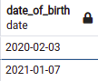
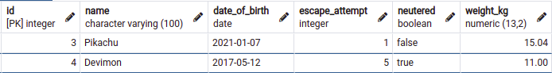

# vet-clinic-database

> This project you uses a relational database to create the initial data structure for a vet clinic. It holds a table to store animals' information, insert some data into it, and query it.

## Screenshots of the database results

List of all animals                | Animals with names "mon"     |  Animals DOB between 2016/2019 year              |
:---------------------------------:|:----------------------------:|:------------------------------------------------:|
         |    |                        |

Neutured and 0-2 escaped attempt   | DOB of "Agumon" or "Pikachu" | Animals that weigh more than 10.5kg              |
:---------------------------------:|:----------------------------:|:------------------------------------------------:|
         |    |                        |

All neutered animals               | Animals not named Gabumon    |Animals with a weight between 10.4kg and 17.3kg   |
:---------------------------------:|:----------------------------:|:------------------------------------------------:|
         |    |                        | 

## Getting Started

This repository includes files with plain SQL that can be used to recreate a database:

- Use [schema.sql](./schema.sql) to create all tables.
- Use [data.sql](./data.sql) to populate tables with sample data.
- Check [queries.sql](./queries.sql) for examples of queries that can be run on a newly created database. **Important note: this file might include queries that make changes in the database (e.g., remove records). Use them responsibly!**

## How to test it locally?

> Please skip the installation steps if you already have a relational database running on your system.
> Note: the lesser than and greater signs in bullet point 3 & 4 should not be part of your database name. They are present there to illustrate where you should include your desired name.
Using  for test case.

- Downloand and install postgresql based on your OS:
 - [Windows](https://www.postgresql.org/download/windows/)
 - [MacOS](https://www.postgresql.org/download/macosx/)
 - Linux:
   - [Debian](https://www.postgresql.org/download/linux/debian/)
   - [Ubuntu](https://www.postgresql.org/download/linux/ubuntu/)
   - [Others](https://www.postgresql.org/download/linux/#generic)

- Switch over to the postgres Account ```sudo su - postgres```. Please enter your system's password if requested for.
- Access postgres: ```psql```
- Create database: ```CREATE DATABASE <please_replace_with_your_database_name>;```
- Connect to the database: ```\c <please_replace_with_your_database_name>;```
- Copy the table structure from **schema.sql** file and run it.
- Follow the snippets from **data.sql** to insert data into the table.
- Try out the snippets from the **queries.sql** to query your table.

## Built With

- POSTGRESQL

## Author

👤 **Muhammad Mustapha Sesay**

- GitHub: [@mmsesay](https://github.com/mmsesay)
- Twitter: [@DeeMaejor](https://twitter.com/DeeMaejor)
- LinkedIn: [Muhammad M Sesay](https://linkedin.com/in/muhammad-m-sesay)

## 🤝 Contributing

Contributions, issues, and feature requests are welcome!

Feel free to check the [issues page](../../issues/).

## Show your support

Give a ⭐️ if you like this project!

## Acknowledgments

- Hat tip to anyone whose code was used
- Inspiration
- etc

## 📝 License

This project is [MIT](./MIT.md) licensed.
